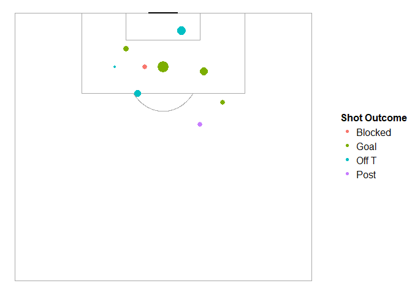

Shot and Touch Charts
================
Mason Turpin
October 11, 2018

I'll hide all of the making of the pitches and acquiring data, as all of that can be found and better explained at the statsbomb and FCrSTATS pages.

Here are a couple plots. One for France's shots vs. Argentina and another for Pogba's ball receipt's in the same match. I'd like to think there's an easier way to deal with the location mapping being a vector inside a dataframe, but this *does* work.

Size in the first chart indicates xG while red in the second chart indicates being under pressure.

``` r
p <- create_StatsBomb_ShotMap("#ffffff", "#A9A9A9", "#ffffff", "#000000")
p
```


``` r
shots <- events %>%
  subset(type.name == "Shot" & team.name == "France")

shots$location.x <- unlist(lapply(shots$location, `[[`,1))
shots$location.y <- unlist(lapply(shots$location, `[[`,2))

p +
  geom_point(data = shots, aes(x = location.y, y = location.x, size = shot.statsbomb_xg, color = shot.outcome.name)) +
  guides(size = FALSE) +
  labs(color = "Shot Outcome") +
  theme(legend.position = "right")
```



``` r
shots$location.x <- unlist(lapply(shots$location, `[[`,1))
shots$location.y <- unlist(lapply(shots$location, `[[`,2))

pogba <- events %>%
  subset(player.name == "Paul Pogba")

pogba$location.x <- unlist(lapply(pogba$location, `[[`,1))
pogba$location.y <- unlist(lapply(pogba$location, `[[`,2))

create_Pitch() +
  geom_point(data = subset(pogba, type.name == "Ball Receipt*"), 
             aes(x = location.x, y = location.y, color = under_pressure)) +
  guides(color = FALSE)
```


This next plot has caused me some trouble. It maps Paul Pogba's passes, in the same game, and assigns color of the arrow based on pass completion and color of the dot based on whether he was under pressure at the time of the pass. My main problem is that the colors are not as I'd prefer (red is incomplete, gray is complete, blue is unknown; green is under pressure). I've commented out some transformations that were doing more harm than good. I'm also assuming NA is complete.

``` r
passes <- events %>%
  subset(type.name == "Pass")

passes$location.x <- unlist(lapply(passes$location, `[[`,1))
passes$location.y <- unlist(lapply(passes$location, `[[`,2))
passes$end.location.x <- unlist(lapply(passes$pass.end_location, `[[`,1))
passes$end.location.y <- unlist(lapply(passes$pass.end_location, `[[`,2))
#passes$pass.outcome.name[is.na(passes$pass.outcome.name) == TRUE] <- "Complete"
passes$pass.outcome.name[passes$pass.outcome.name == "Out"] <- "Incomplete"
passes$pass.outcome.name[passes$pass.outcome.name == "Pass Offside"] <- "Incomplete"
#passes <- passes[!(passes$pass.outcome.name == "Unknown"),] 
table(passes$pass.outcome.name)
```

    ## 
    ## Incomplete    Unknown 
    ##        145          9

``` r
library(ggthemes)
p <- create_Pitch() +
  geom_segment(data = subset(passes, player.name == "Paul Pogba"), aes(x = location.x, y = location.y, 
                                  xend = end.location.x, yend = end.location.y, color = pass.outcome.name), 
               arrow = arrow(length = unit(.3, "cm"))) +
  geom_point(data = subset(passes, player.name == "Paul Pogba"), 
             aes(x = location.x, y = location.y, color = under_pressure)) +
  guides(color = FALSE)
p
```


