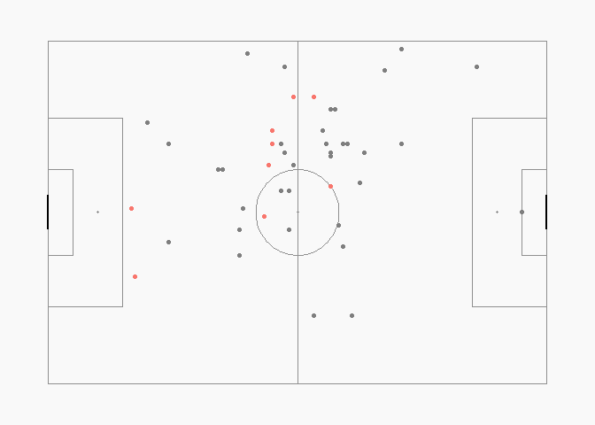

Shot and Touch Charts
================
Mason Turpin
October 11, 2018

I'll hide all of the making of the pitches and acquiring data, as all of that can be found and better explained at the statsbomb and FCrSTATS pages.

Here are a couple plots. One for France's shots vs. Argentina and another for Pogba's ball receipt's in the same match. I'd like to think there's an easier way to deal with the location mapping being a vector inside a dataframe, but this *does* work.

``` r
p <- create_StatsBomb_ShotMap("#ffffff", "#A9A9A9", "#ffffff", "#000000")
p
```


``` r
shots <- events %>%
  subset(type.name == "Shot" & team.name == "France")

shots$location.x <- unlist(lapply(shots$location, `[[`,1))
shots$location.y <- unlist(lapply(shots$location, `[[`,2))

p +
  geom_point(data = shots, aes(x = location.y, y = location.x, size = shot.statsbomb_xg, color = shot.outcome.name)) +
  guides(size = FALSE) +
  labs(color = "Shot Outcome") +
  theme(legend.position = "right")
```


``` r
shots$location.x <- unlist(lapply(shots$location, `[[`,1))
shots$location.y <- unlist(lapply(shots$location, `[[`,2))

pogba <- events %>%
  subset(player.name == "Paul Pogba")

pogba$location.x <- unlist(lapply(pogba$location, `[[`,1))
pogba$location.y <- unlist(lapply(pogba$location, `[[`,2))

create_Pitch() +
  geom_point(data = subset(pogba, type.name == "Ball Receipt*"), 
             aes(x = location.x, y = location.y, color = under_pressure)) +
  guides(color = FALSE)
```


